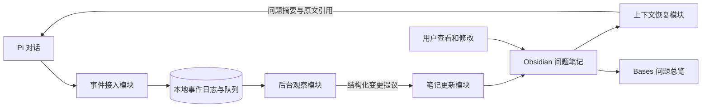
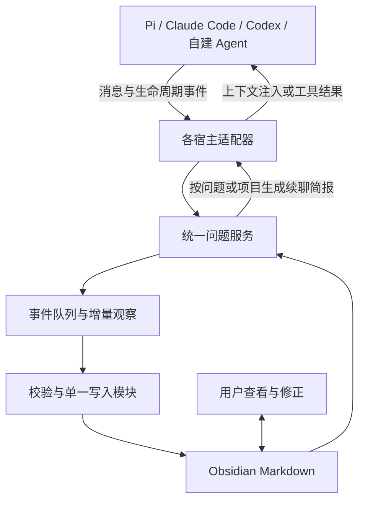

# Agent × Obsidian：问题记录与续聊设计

日期：2026-09-15

状态：完整目标架构的设计提案，已有部分实现，未完成全部功能或真实对话验收。按单人、本地 Pi/omp、一个 Obsidian Vault 起步，第 8 节扩展到跨宿主；多设备并发写入不包含在首版范围。

2026-09-16 已提供 [conversation-ledger Skill](../skills/conversation-ledger/README.md)，包含记录与续聊规则、模板，以及可选的三宿主事件采集运行时。运行时保存来源、导出 Markdown、引导下一轮整理并记录批次确认，使用本地事件文件实现队列。本文中的独立后台观察者、SQLite 实现、MCP 服务和共享问题写入模块仍是后续方案；当前问题笔记的文件读改写不能提供完整并发保证。[当前运行时操作与覆盖范围](../skills/conversation-ledger/references/runtime.md)

相关材料：[现象分析](./agent-conversation-topic-loss.zh-CN.md) · [现有机制调研](./agent-conversation-question-tracking-research.zh-CN.md)。

## 1. 目标与使用流程

用户继续自然对话，系统记录其中值得保留的问题、讨论进展和证据。在 Obsidian 中可以查看、纠正和整理这些记录；继续讨论时，Agent 读取对应问题的当前状态和必要原文。

首版需要完成两条路径：

- 对话 → 捕获问题 → 更新进展 → Obsidian 中可以找到。
- Obsidian 中选择问题 → 生成续聊上下文 → Agent 继续 → 新进展回到同一问题。

核心记录单位是问题。会话提供来源，主题提供组织方式；一个问题可以跨多个会话，一次会话可以涉及多个问题。

## 2. 总体结构



### 模块职责

| Module | Interface | Implementation 中隐藏的工作 |
| --- | --- | --- |
| 事件接入模块 | `ingest(event)` | 会话和分支标识、消息去重、持久化、断点补采 |
| 后台观察模块 | `observe(delta, questions)` | 相关问题选择、模型抽取、候选去重、进展与证据匹配 |
| 笔记更新模块 | `apply(proposal)` | 状态规则、来源校验、过期判断、手工修改保护、写入和重试 |
| 上下文恢复模块 | `recall(questionId)` | 当前问题、依赖、近期结论、未解决点和原文的有界组装 |

以上是拟实现的接口，不是现成 CLI 命令。首版可以放在同一个 TypeScript 程序中，无须分别部署。

Skill 保存观察和整理规则；Pi Extension 提供生命周期触发；Obsidian 承载可读可编辑的记录。MCP 可在需要被其他宿主调用时再封装这些接口。

## 3. 数据放在哪里

### 3.1 Vault 结构

```text
Agent/
├── Sessions/           # 一次会话一篇：议题索引、来源消息、关键证据
├── Questions/          # 一个持续跟踪的问题一篇
├── Topics/             # 按需整理的主题入口
└── 问题总览.base       # 待讨论、待验证、暂放、近期进展等视图
```

所有用户提出的疑问先在会话记录中留下候选。明确要求保留、持续展开或需要后续处理的问题，再形成独立问题笔记。普通解释、例子和 Agent 顺带推荐的方向不自动变成待办。

实际 ID 使用全局唯一标识，文件名保持稳定；标题可以通过正文和别名修改。下例短 ID 仅用于展示结构。

```markdown
---
id: Q-001
type: question
status: exploring
project: agent-workflow
created: 2026-09-15
updated: 2026-09-15
discovered_from:
  - "[[Agent/Questions/Q-000]]"
sources:
  - "[[Agent/Sessions/S-001#^m-0042]]"
---

# 如何保留 Agent 对话里的关键问题？

## 我的判断
用户自己的批注、偏好和修正。

## 当前进展
已分析问题遗失的类型，正在讨论 Obsidian 的接入方式。

## 尚未解决
- 什么情况下将候选疑问提升为独立问题？
- 后台更新如何保留手工修改？

## 继续入口
先验证捕获、回看、续聊能否闭环。

## 来源与进展记录
- 来自 [[Agent/Sessions/S-001#^m-0042]]。
```

YAML 使用扁平属性和列表，复杂论证留在正文。Obsidian 支持这些属性和内部链接，但其属性编辑界面不支持嵌套属性；块引用用于定位会话原文。[Properties](https://obsidian.md/help/properties)、[Internal links](https://obsidian.md/help/links)

### 3.2 事实归属

| 数据 | 权威位置 |
| --- | --- |
| 问题当前状态、用户判断、当前结论 | Vault 中的问题 Markdown |
| 发生过的原始消息与关键工具证据 | 本地追加事件日志；会话笔记提供可读引用 |
| 待处理事件、提议、写入确认 | 本地运行目录的 SQLite |
| 标题、关键词、ID 到路径映射等检索索引 | SQLite，可从笔记重建 |
| 表格视图 | `.base` 文件，读取笔记属性 |

SQLite 不另外维护一份与 Markdown 竞争的问题当前状态。问题笔记被手工修改后，索引随之刷新；下一次观察和续聊读取当前版本。

Sessions 中保存原文时给消息分配稳定块 ID，例如 `^m-0042`。进展和结论的引用需要落到原文或外部验证结果，不能仅引用另一段模型总结。详细工具输出可留在本地事件日志，通过事件 ID 追溯。

## 4. 一次对话怎样被处理

### 4.1 先记录事件，再调用模型

事件包含宿主、会话、分支、消息 ID、顺序、角色和内容。消息 ID 在同一来源内重复到达时不重复插入；不能按文本内容去重，因为用户可能真的重复提出相同问题。

主对话只等待短暂的本地记录确认。模型提取、文件整理均走后台；进程退出或模型请求失败后，未确认的事件仍在队列里，后续可补处理。

### 4.2 根据任务阶段调度

| 时机 | 拟执行行为 |
| --- | --- |
| 用户消息进入 | 记录原文并排队，保留新的问题候选 |
| Agent 中途调用工具 | 累积必要事件，合并观察批次 |
| 一轮用户请求处理完毕 | 观察新增内容，提出问题与进展变更 |
| 上下文压缩前 | 保存待处理事件和问题引用，不要求等待长模型调用 |
| 新会话或恢复会话 | 按项目、问题 ID、分支装配少量相关上下文 |
| 用户选择继续某个问题 | 读取该问题最新笔记与必要来源 |

Pi 的 `turn_end` 是一次模型响应及其工具调用；`agent_settled` 表示没有自动重试、压缩或后续继续待执行。首版用后者作为整理边界，用 `before_agent_start` 注入已准备好的上下文。派生版本的接入需要重新核对等价事件。[Pi Extensions](https://pi.dev/docs/latest/extensions)

### 4.3 观察者输出变更提议

输入为：新增对话、当前分支关联的问题、检索到的少量候选问题，以及必要的原文。首版先用 ID、项目、标题关键词和显式链接检索，再由模型判别是否同一问题。

输出限定为新增候选、创建问题、追加进展、建议改状态、关联来源、建议合并等结构化操作。模型不生成任意目标路径，也不直接整篇覆盖笔记。

每项操作带有操作 ID、目标问题 ID、依据消息 ID 和所基于的笔记版本。笔记更新模块负责：

1. 校验字段及状态是否合法，来源是否存在。
2. 对相同操作去重；重试不重复写入。
3. 检查笔记是否已被用户或新一轮更新修改。
4. 独立进展可追加；过期的状态变更重新判断。
5. 先写入来源记录，再更新引用它的问题。
6. 写入成功后才确认队列；处理中断时通过操作标记识别已完成的写入。

这里只让一个写入模块处理 Agent 更新。不同会话不直接争抢同一篇笔记。

### 4.4 状态与关闭规则

初版状态：待讨论、讨论中、待验证、暂放、已收束、不再继续。候选疑问留在会话候选列表，提升为独立笔记后进入这些状态。

- 一段回答可产生进展或阶段结论，不自动关闭问题。
- 关闭需关联明确结论、验证结果或用户的收束决定。
- 新发现可以重新打开问题；保留此前结论及变更原因。
- 合并问题保留原 ID 和指向，不直接删除来源。
- 用户手工设置的状态或优先级优先于模型推断；自动更新只追加新证据或提出建议。

首版可先让 AI 追加进展和状态建议，状态由用户直接编辑；验证规则后再逐步自动化可靠的转换。整个流程不要求逐条弹窗确认。

## 5. Obsidian 接入和写入方式

### 5.1 首个可用版本：官方 CLI

官方 CLI 已有创建、读取、追加笔记、属性操作、搜索和 `base:query`。它要求桌面应用运行，未运行时首次调用会启动应用。实现时指定 Vault ID 和完整相对路径，避免落到当前活动文件。[Obsidian CLI](https://obsidian.md/help/cli)

初版自动执行创建、追加来源和进展，尽量减少对现有内容的覆盖；状态建议追加为记录，用户可在属性视图直接调整。

后台写入默认只在 Obsidian 已连接时执行；应用关闭时继续保留事件和待写操作，重新打开后补写。避免每个后台事件都启动应用。此时应显示待同步状态，不能提前宣称笔记已保存。

### 5.2 自动修改同一笔记：增加薄插件

当需要持续更新指定正文区块、属性和用户修正时，引入一个薄插件负责最后的写入。观察与检索仍留在本地后台程序中。

插件接收经过校验的变更，读取笔记当前内容；在 `Vault.process()` 中复核版本并修改允许管理的区块，保留其他内容。模型调用在此前完成，不能放进同步修改回调中。官方文档推荐这类读改写方式，并要求异步处理后重新检查内容是否变化。[Vault API](https://docs.obsidian.md/Plugins/Vault)

插件还记录手工变更与 Agent 写入的来源。若用户修改了状态，标记该字段由用户维护；后来的后台推断保留为建议。同步软件或其他进程引发的冲突也按版本变化处理，首版不宣称支持多设备同时自动写入。

## 6. 查看和继续讨论

### Bases 视图

首版提供四个视图：

- 待继续：尚未收束的问题，按最近讨论和用户优先级排序。
- 待验证：已有判断但仍缺证据。
- 暂放：保留未来入口，不自动提醒回到主线。
- 近期进展：最近新增或有内容更新的问题。

Bases 是 Obsidian 的核心插件，视图直接使用本地 Markdown 及属性，可查看、编辑、排序和筛选，不需要独立复制一份表格数据。[Introduction to Bases](https://obsidian.md/help/bases)

### 续聊上下文

选中一个问题后，上下文恢复模块生成有长度限制的材料：

1. 当前问题和用户最新修正。
2. 已有结论与适用前提。
3. 尚未解决点及必要的依赖问题。
4. 最近证据和对应原文链接。
5. 下一步建议。

首版可以生成一段可复制的续聊简报。接入 Pi Extension 后，可以通过问题 ID 将简报送入当前或新会话。仅浏览笔记不自动开始执行；用户选择继续后，新会话关联到原问题 ID，后续进展写回同一篇笔记。

当观察者落后于对话时，简报标注已处理到的消息位置，并包含尚未整理的最近消息，避免把旧问题状态当作最新状态。

## 7. 分阶段实现与验收

| 阶段 | 交付 | 验收 |
| --- | --- | --- |
| A：记录与续聊 | Skill 规则、问题模板、官方 CLI 写入、Bases、复制续聊简报 | 能从一段多话题对话留下问题，隔天找回并继续 |
| B：自动观察 | Pi Extension、本地事件队列、增量观察、单一写入模块 | 无须每轮手动调用；中断恢复不丢事件，不重复建项 |
| C：编辑协作 | Obsidian 薄插件、版本检查、字段归属、问题选择后续聊 | 手工修改保留；迟到判断不覆盖新结论；问题不会误关联到其他分支 |

跨宿主接入扩展见第 8 节；多设备同步和大规模语义检索仍按实际需求增加。

验证分两类：机制验证覆盖事件重放、重复消息、同笔记并发更新、应用关闭、进程中断、会话分叉和用户改状态；语义验证使用用户标注过的真实对话，检查关键问题召回、重复建项、错误关闭、恢复成本和额外延迟。

完成标准是用户能看清哪些问题仍有价值、各自到了哪里，并在下一次对话直接接着推进。

## 8. 扩展：让不同 Agent 共用这项能力

### 8.1 总体设计

把问题记录与恢复做成独立服务，通过薄适配器接入各个 Agent 宿主。这里的宿主是 Pi、Claude Code、Codex 或自建 Agent 应用；更换同一宿主使用的模型通常不需要重新实现记录系统。



沿用前文的数据归属：Markdown 保存当前问题状态；事件日志保存原始依据；队列和检索索引可以重建。多个 Agent 共享同一套服务和问题 ID，Agent 会话结束不影响问题继续存在。

### 8.2 分开定义三个支持维度

| 维度 | 能力 | 所需条件 |
| --- | --- | --- |
| 主动调用 | Agent 查询问题、提交进展、读取续聊简报 | MCP、CLI 或函数工具 |
| 自动记录 | 用户无须每轮提醒，后台收到新增对话并整理 | 宿主 hook、extension、SDK 或事件流 |
| 自动恢复 | 新会话、继续问题或压缩后装配相关上下文 | 提示词注入点、会话 API 或宿主扩展 |

适配器分别报告这些能力和覆盖范围，不用一个“支持”标签掩盖缺口。MCP 的工具协议提供发现和调用机制，不规定每轮触发，也不是全量对话订阅接口。因此，仅配置 MCP 不能保证自动记录与恢复。[MCP Tools](https://modelcontextprotocol.io/specification/2025-11-25/server/tools)

对没有开放接口、扩展或可用导出方式的产品，无法保证全自动接入。可退化为用户复制对话、导入导出文件，以及粘贴续聊简报；界面应明确这是手动覆盖。云端 Agent 要使用本地服务，还需要它能访问的连接方式，不能把本机 localhost 当成云端可达地址。

### 8.3 Skill、适配器、服务各管什么

- **Skill**：告诉主 Agent 如何查找、引用和继续问题，以及如何区分进展、结论和关闭；只保留一份语义规则源，按宿主格式分发。
- **适配器**：订阅真实事件，转换消息与标识，保存发送游标，投递事件，注入服务返回的上下文；不单独实现问题判断逻辑。
- **统一服务**：去重、关联问题、增量观察、校验变更、写笔记、检索和生成续聊简报。可靠状态约束放在代码中，语义识别仍需评估模型误差。
- **Obsidian**：供用户查看和修正；工具入口通过统一写入模块更新笔记，避免各 Agent 各自维护一份账本。

“每一轮都判断”由运行时事件触发后台观察；Skill 承载的文字规则本身不能保证执行。投递事件应快速落队列，模型整理在后台合并进行。读取最新状态时返回处理进度，不把尚未整理的消息假装为已完成。

### 8.4 最小对外接口草案

以下是建议实现的业务接口，不是某个现有产品的命令：

```text
ingest(event)                                  # 适配器投递消息和生命周期事件
list_questions(scope, filters)                 # 查看当前相关问题
get_context(question_id, budget)               # 获取有长度限制的续聊材料
propose_change(question_id, evidence, revision) # 提交有来源的进展或状态建议
```

事件至少带：协议版本、事件 ID、宿主及安装实例 ID、会话 ID、消息 ID、分支及父会话引用、项目范围、消息来源类型和时间。可用原生事件 ID 时保留原值；否则适配器生成并持久化本地标识，不能每次重试都生成新 ID。

Agent 通过 MCP 或函数工具使用后三个接口；hook 可通过 CLI 把事件交给同一个本地服务。记录服务注入的简报带来源标记，后续观察时排除自身回声。主 Agent 转述子 Agent 的结论时复用来源引用，避免把同一发现建立两次。

### 8.5 具体宿主如何接

以下接入点根据 2026-09-15 查阅的官方文档整理；安装时需要核对实际版本和事件覆盖。

| 宿主 | 采集路径 | 恢复路径 |
| --- | --- | --- |
| Pi | Extension 收集消息，在 `agent_settled` 后提交观察批次 | `before_agent_start` 注入相关材料 |
| Claude Code | `UserPromptSubmit` 收输入，`Stop` 收最终回复；按需补充其他事件 | `SessionStart` / `UserPromptSubmit` 返回附加上下文 |
| Codex | Hooks 收输入及最终回复；需要结构化完整事件时接 App Server | Hooks 注入上下文，或由受控客户端组装下一轮输入 |
| 自建 API Agent | 在消息处理循环中加入适配层 | 在发送模型请求前加入相关上下文 |
| 仅支持工具调用的宿主 | MCP / CLI 主动提交 | 主动调用上下文工具 |

Pi 的 `agent_settled` 与底层一次模型响应结束不同，可以作为无自动后续运行时的整理边界；`before_agent_start` 支持注入消息。[Pi Extensions](https://pi.dev/docs/latest/extensions)

Claude Code 的 `Stop` 有 `last_assistant_message`；用户打断不会触发该事件，API 错误另有事件。采集器需要如实报告覆盖范围，不能只用 Stop 声称拿到了所有消息。记录 hook 不返回要求 Agent 继续的阻止信号。[Claude Code Hooks](https://code.claude.com/docs/en/hooks)

Codex 当前 Hooks 包含 `UserPromptSubmit`、`Stop`、`SessionStart` 和压缩相关事件；其文档明确 transcript 文件格式不是稳定接口。基础适配优先使用 hook 字段。[Codex Hooks](https://learn.chatgpt.com/docs/hooks)

需要更完整的 Codex 接入时，App Server 提供 `item/completed` 和 `turn/completed` 等事件；后者还可能表示中断或失败。它适用于客户端启动、恢复或接入的会话，不能因为部署一个监听进程就声称已覆盖所有独立客户端。[Codex App Server](https://learn.chatgpt.com/docs/app-server)

### 8.6 共享状态，按当前任务提供上下文

全局问题 ID 解决跨 Agent 续聊；项目范围、显式问题选择和分支关系决定当前 Agent 应看到什么。更换 Agent 时保留问题 ID，更换任务时重新确定相关范围。

用户在 Obsidian 修改的问题状态优先；两个 Agent 对同一问题提出不同结论时，先保留各自证据与分歧。单一写入模块检查所依据的版本，过期关闭建议不能覆盖新的用户决定。这里保证的是自动写入有统一入口，用户和同步软件引发的文件变化仍按前文版本检查处理。

自动恢复只提供相关事实、未解决点和来源，并将历史引文标识为数据。恢复上下文不表示授权执行所有待办，也不要求 Agent 把用户带回原话题。用户明确选择“继续某个问题”时才把该问题设为当前任务。

### 8.7 最小交付与验收

先实现一个本地问题服务、一个 Obsidian 写入入口、一个通用工具接口，再接入实际最常用的两个宿主；第三个宿主用于验证接入是否只需增加适配器。安装程序负责连接已有服务和合并宿主配置，不覆盖用户已有 hooks。

最重要的验收场景：在 Claude Code 中提出 Q001，在 Pi 中继续验证，在 Codex 中补充评审，三个会话更新同一篇问题笔记；用户在 Obsidian 改为“暂放”后，各 Agent 下次读取都尊重这个状态。

此外检查：事件重试不重复建项、父子会话来源不重复、服务离线后可补写、未覆盖消息明确可见，以及旁观记录不会触发 Agent 自行继续执行。安装健康检查同时验证“事件送得进来”和“续聊材料回得去”；仅工具列表可见不算自动接入完成。

本节记录完整目标。当前已提供 Codex、Claude Code 和 Pi 的文本/生命周期采集与上下文引导适配器；完整问题服务、独立后台观察和共享写入仍待实现。配置安装与真实宿主生效应分别验收。
